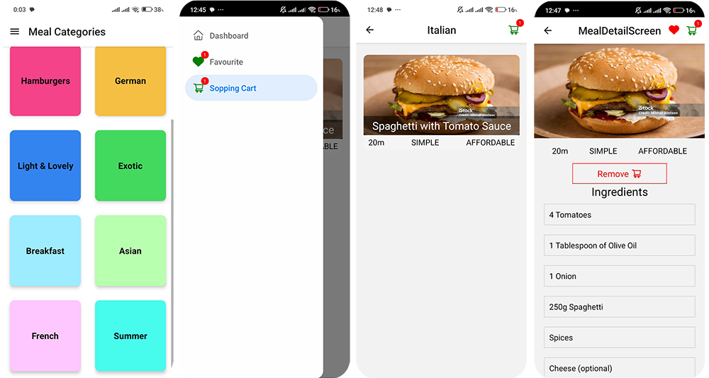

# 🍕 React Native FoodCart - E-commerce Food Order App

**React Native FoodCart** is a mobile-first e-commerce app built with React Native that allows users to browse, order, and track food deliveries from local restaurants. Designed for seamless performance on both Android and iOS.

---

## 🚀 Screens



## 📱 Features

- 🛍️ Browse restaurants and food categories
- 🔍 Search and filter food items
- 🧺 Add to cart and place orders
- 💳 Integrate with payment gateways (e.g., Stripe)
- 📦 View order history and live order tracking
- 🔐 User authentication (Sign In/Sign Up)
- 🔔 Push notifications for order updates

---

## ⚙️ Tech Stack

- **Frontend:** React Native (Expo or CLI)
- **Navigation:** React Navigation
- **State Management:** Redux
- **Backend:** Node.js, Express
- **Database:** Firebase Firestore
- **Push Notifications:** Expo Notifications / Firebase Cloud Messaging

---

## 🧑‍💻 Getting Started

### Prerequisites

- Node.js & npm
- Expo CLI (`npm install -g expo-cli`)
- Android Studio or Xcode (for emulator/simulator)
- Firebase project (optional)
- Stripe account (optional)

### Installation

1. **Clone the repo**
   ```bash
   git clone https://github.com/mdtaslimkhan/foodcart.git
   cd FoodCart-app
   ```

2. **Install dependencies**
   ```bash
   npm install
   ```

3. **Configure environment**
   - Create a `.env` file in the root
   - Add Firebase, Stripe, or API base URLs

4. **Run the app**
   ```bash
   npm start
   # or
   expo start
   ```

---

## 📁 Folder Structure

```
FoodCart-app/
├── assets/               # Images, icons, etc.
├── components/           # Reusable UI components
├── screens/              # Screen components (Home, Cart, etc.)
├── redux/ or context/    # State management
├── App.js
└── .env
```


## 📸 Screenshots

> Add screenshots or GIFs here to show off your UI.

---

## 🚀 Roadmap

- [x] Core functionality (Browse, Cart, Checkout)
- [x] Firebase Authentication
- [ ] Real-time order tracking with sockets
- [ ] Restaurant/Admin dashboard (web)
- [ ] Ratings & Reviews

---

## 🤝 Contributing

Pull requests are welcome! Follow these steps:

1. Fork the project
2. Create your feature branch (`git checkout -b feature/awesome-feature`)
3. Commit your changes (`git commit -m 'Add awesome feature'`)
4. Push to the branch (`git push origin feature/awesome-feature`)
5. Open a pull request

---

## 📄 License

This project is licensed under the MIT License.

---

## 🙌 Acknowledgements

- [React Native](https://reactnative.dev/)
- [Expo](https://expo.dev/)
- [Firebase](https://firebase.google.com/)
- [Stripe](https://stripe.com/)
- [React Navigation](https://reactnavigation.org/)

---

## 📬 Contact

For inquiries or feedback, please contact:

- Email: asalam773@gmail.com
- GitHub: (https://github.com/mdtaslimkhan)
- Project Link: (https://github.com/mdtaslimkhan/foodcart)

---

Feel free to customize this template further to align with your project's specific requirements and branding. 